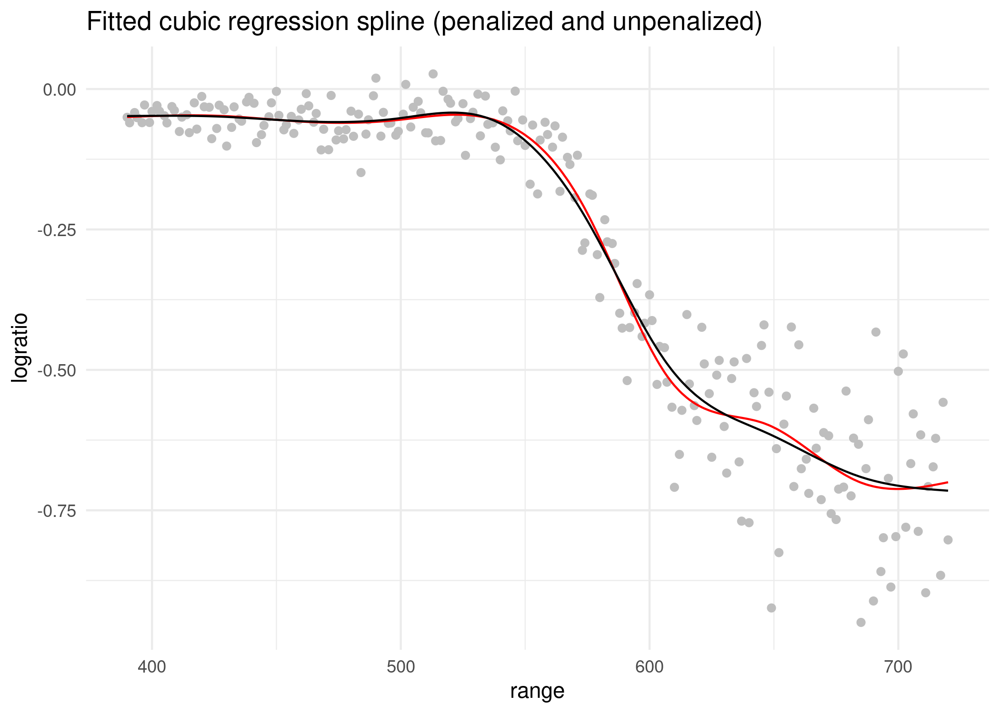

<!-- README.md is generated from README.Rmd. Please edit that file -->

# SmoothOperator 

<!-- badges: start -->

<!-- badges: end -->

> Easy Feature Engineering with mgcv Penalized Spline Smooths

A convenient API for working with penalized spline smooths, based on the
mgcv package. The smooths can easily be integrated with user-defined
models and algorithms.

## Installation

You can install the development version of SmoothOperator from
[GitHub](https://github.com/) with:

``` r
# install.packages("devtools")
devtools::install_github("hriebl/SmoothOperator")
```

## Example

Define and construct a simple cubic regression spline:

``` r
library(SmoothOperator)
set.seed(1337)

df <- data.frame(x = runif(100))
smt <- Smooth$new("x", df, bs = "cr", k = 10)
smt
#> <Smooth>
#>   Public:
#>     absorb_constraints: TRUE
#>     add_centering_constraint: function () 
#>     add_point_constraints: function (data) 
#>     bs: cr
#>     clone: function (deep = FALSE) 
#>     constraints: NULL
#>     construct: function (data = NULL) 
#>     data: data.frame
#>     identity_penalty: FALSE
#>     initialize: function (terms, data, bs = "tp", k = 10) 
#>     initialize_constraints: function () 
#>     initialize_knots: function () 
#>     k: 10
#>     knots: NULL
#>     m: NA
#>     remove_all_constraints: function () 
#>     scale_penalty: TRUE
#>     terms: x
#>     xt: NULL
#>   Private:
#>     add_constraints: function (new) 
#>     s: function ()

mat <- smt$construct()
str(mat)
#> List of 3
#>  $ design_matrix   : num [1:100, 1:9] -0.1101 -0.1111 0.4374 -0.0771 -0.0406 ...
#>  $ penalty_matrices:List of 1
#>   ..$ : num [1:9, 1:9] 0.54038 -0.45371 0.26777 0.00597 0.07403 ...
#>  $ ranks           : num 8
```

Initialize and inspect knots and constraints:

``` r
smt$initialize_knots()
smt$knots
#>             x
#> 1  0.02522857
#> 2  0.14127644
#> 3  0.24540405
#> 4  0.33913968
#> 5  0.47802501
#> 6  0.59722110
#> 7  0.73213332
#> 8  0.84627031
#> 9  0.94763002
#> 10 0.99971561

# adds an explicit centering constraint
smt$initialize_constraints()
smt$constraints
#>            [,1]      [,2]      [,3]       [,4]      [,5]      [,6]      [,7]
#> [1,] 0.04813571 0.1139502 0.1262563 0.09708947 0.1047601 0.1184304 0.1267345
#>            [,8]     [,9]      [,10]
#> [1,] 0.08647797 0.124193 0.05397238

pc <- data.frame(x = 0.5)
smt$add_point_constraints(pc)
smt$constraints
#>             [,1]         [,2]       [,3]        [,4]      [,5]      [,6]
#> [1,] 0.048135705  0.113950156 0.12625629  0.09708947 0.1047601 0.1184304
#> [2,] 0.001184691 -0.008088538 0.03766261 -0.10002457 0.9166500 0.1864093
#>             [,7]       [,8]         [,9]       [,10]
#> [1,]  0.12673449 0.08647797  0.124193020 0.053972380
#> [2,] -0.04534949 0.01541751 -0.005727267 0.001865725
```

### Fitting a penalized cubic regression spline

Now, let’s use SmoothOperator to fit a penalized cubic regression spline
to the `lidar` dataset from the SemiPar package, a classic dataset for
non-parametric regression. See also `?SemiPar::lidar`. This example
shows how easy it is to set up a smooth with SmoothOperator and use it
in a self-defined model.

``` r
library(ggplot2)
library(SemiPar)
data(lidar)

ggplot(lidar, aes(range, logratio)) +
  geom_point(color = "gray") +
  ggtitle("SemiPar::lidar dataset") +
  theme_minimal()
```


First, we set up the smooth and initialize the knots. As an
illustration, we add some random noise to the knots, just because we
can. In practice, you will want to adjust the knots in a more meaningful
way. Finally, we construct the design and the penalty matrix.

``` r
smt <- Smooth$new("range", lidar, bs = "cr", k = 10)
smt$initialize_knots()
smt$knots
#>       range
#> 1  390.0000
#> 2  426.4444
#> 3  462.8889
#> 4  499.6667
#> 5  536.5556
#> 6  573.2222
#> 7  609.6667
#> 8  646.2222
#> 9  683.1111
#> 10 720.0000

smt$knots <- smt$knots + rnorm(10)
smt$knots
#>       range
#> 1  389.9635
#> 2  427.5624
#> 3  462.1888
#> 4  498.5426
#> 5  535.9425
#> 6  574.2347
#> 7  607.3228
#> 8  646.8125
#> 9  683.4302
#> 10 720.7016

mat <- smt$construct()
dim(mat$design_matrix)
#> [1] 221   9
dim(mat$penalty_matrices[[1]])
#> [1] 9 9
```

Here, we define the log-posterior of the non-parametric regression model
and determine the maximum a posteriori (MAP) estimate with the `optim()`
function from R:

``` r
nbeta <- ncol(mat$design_matrix)
param <- c(0, rep(0, nbeta), 0, 0)

logpost <- function(param, y, X, K, rk) {
  nbeta <- ncol(X)

  beta0 <- param[1]
  beta <- param[2:(nbeta + 1)]
  lambda <- exp(param[nbeta + 2])
  sigma <- exp(param[nbeta + 3])

  mu <- beta0 + drop(X %*% beta)

  loglik <- sum(dnorm(y, mu, sigma, log = TRUE))
  logprior <- rk / 2 * log(lambda) - lambda * drop(beta %*% K %*% beta)

  loglik + logprior
}

map <- optim(
  par = param,
  fn = logpost,
  y = lidar$logratio,
  X = mat$design_matrix,
  K = mat$penalty_matrices[[1]],
  rk = mat$ranks[[1]],
  method = "BFGS",
  control = list(fnscale = -1)
)
```

Finally, we plot the fit to confirm that it looks reasonable. The red
line shows the unpenalized smooth for comparison, which certainly is
more wiggly than the penalized version.

``` r
param <- map$par

beta0 <- param[1]
beta <- param[2:(nbeta + 1)]

mu1 <- beta0 + drop(mat$design_matrix %*% beta)

mod <- lm(lidar$logratio ~ mat$design_matrix)
mu2 <- fitted(mod)

ggplot(lidar, aes(range, logratio)) +
  geom_point(color = "gray") +
  geom_line(y = mu2, color = "red") +
  geom_line(y = mu1) +
  ggtitle("Fitted cubic regression spline (penalized and unpenalized)") +
  theme_minimal()
```


